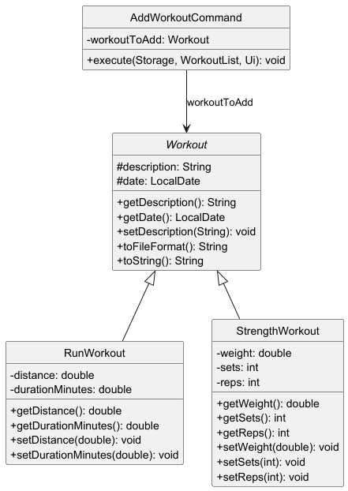
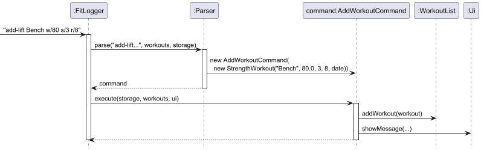

# Developer Guide

## Acknowledgements

{list here sources of all reused/adapted ideas, code, documentation, and third-party libraries -- include links to the original source as well}

## Design & implementation

### Enhancement 1: `EditCommand`

#### Purpose and user value

`EditCommand` lets users modify an existing workout entry without deleting and recreating it.
This reduces friction when correcting common input mistakes (for example, wrong distance, duration,
sets, reps, weight, name, or description) while preserving the original workout ordering.

Supported fields:
- For all workouts: `name`, `description`
- For run workouts: `distance`, `duration`
- For strength workouts: `weight`, `sets`, `reps`

Command format:

```
edit <index> <field>/<value>
```

Examples:
- `edit 1 distance/4.67`
- `edit 2 reps/10`
- `edit 3 name/Tempo Run`

#### Design overview

At the architecture level, this enhancement follows FitLogger's existing command pipeline:

1. `Parser.parse(...)` receives raw user input.
2. `Parser.parseEdit(...)` validates format and extracts the index, field, and value.
3. `Parser` returns an `EditCommand` as a `Command`.
4. The runtime invokes `Command.execute(storage, workouts, ui)` polymorphically.
5. `EditCommand` updates the selected `Workout` and reports the result through `Ui`.

Responsibilities remain clearly separated:
- Parser handles *syntax checking and tokenization*.
- Command handles *execution logic and field dispatch*.
- Workout classes enforce *domain invariants* through setter validation.

#### Component-level behavior

`EditCommand.execute(...)` performs the following steps:

1. Convert the user index from one-based to zero-based.
2. Validate bounds (`index >= 1 && index <= workouts.getSize()`).
3. Retrieve the target workout from `WorkoutList`.
4. Dispatch by field name using a switch statement.
5. Validate workout type compatibility for type-specific fields:
	- Reject `weight/sets/reps` for run workouts.
	- Reject `distance/duration` for strength workouts.
6. Parse numeric values for numeric fields.
7. Delegate final validation to domain setters.
8. Show a clear success or error message.

The command is intentionally defensive:
- Unknown fields are rejected (`Unknown editable field: ...`).
- Non-numeric numeric inputs are rejected.
- Invalid domain values are rejected via `FitLoggerException`.
- Name/description edits are validated against reserved storage delimiters (`|` and `/`) to prevent save-file corruption.

#### Data integrity and validation decisions

Key safeguards:

- **Delimiter safety**: edited names/descriptions are rejected when they contain reserved storage separators.
- **Finite numeric values**: `NaN` and `Infinity` are rejected for distance, duration, and weight.
- **Domain constraints**:
  - distance, duration > 0
  - weight >= 0
  - sets, reps > 0

These rules prevent invalid in-memory state and malformed persisted data.

#### Testing strategy

`EditCommandTest` covers both success and failure paths:

- Valid updates for run and strength workouts.
- Invalid index handling.
- Type mismatch handling (for example, lift-only fields on run workouts).
- Delimiter injection prevention for edited names.
- Rejection of non-finite numeric values (`NaN`, `Infinity`).

This verifies robust behavior under realistic user mistakes and malformed input.

#### Example usage scenario

Given below is an example scenario of how `EditCommand` is processed.

**Step 1.** The user enters an edit command, for example `edit 2 reps/10`.

**Step 2.** `Parser.parse(...)` routes the input to `Parser.parseEdit(...)`, which validates the command format and
extracts the index, field, and value.

**Step 3.** `Parser` returns an `EditCommand` object to the main execution loop.

**Step 4.** During `EditCommand.execute(storage, workouts, ui)`, the command validates index bounds, checks field
compatibility with workout type, and parses/validates the new value.

**Step 5.** The target workout is updated through setter methods, and a success message is printed. If any validation
fails, an error message is shown instead.

---

### Enhancement 2: `DeleteCommand`

#### Purpose and user value

`DeleteCommand` allows users to remove workouts by index or by name.
This supports both quick positional deletion and direct name-based deletion,
depending on whether users remember list order or workout name.

Supported formats:
- `delete <index>`
- `delete <workout_name>`

#### Design overview

The command is intentionally simple and cohesive:

1. Parser identifies the `delete` command and passes the raw argument string.
2. `DeleteCommand` stores only the user-supplied target text.
3. During execution, the command resolves the target as index-or-name.
4. If found, workout is removed from `WorkoutList`; otherwise, user sees not-found feedback.

This design keeps parsing and command behavior focused while preserving compatibility with the existing pipeline.

#### Component-level behavior

`DeleteCommand.execute(...)` performs:

1. Empty input check:
	- If blank, show usage guidance and return early.
2. Target resolution (`findWorkoutIndex(...)`):
	- First, attempt numeric parsing (`parseUserProvidedIndex`).
	- If numeric, convert one-based user index to zero-based list index.
	- If non-numeric, perform case-insensitive full-name match.
3. Deletion:
	- On match, delete the workout and show `Deleted workout: <name>`.
	- On miss, show `Workout not found: <input>`.

This approach avoids ambiguity and keeps deletion behavior predictable.

#### Edge cases handled

- Blank target text.
- Out-of-range numeric index (e.g., 0 or larger than current list size).
- Non-numeric text that does not match any workout name.
- Case-insensitive name matching for better usability.

#### Testing strategy

`DeleteCommandTest` verifies:

- Name-based deletion success.
- Index-based deletion success (one-based input behavior).
- Blank-input usage message.
- Not-found message for missing name.
- Not-found message for invalid numeric index.

This ensures both deletion flows (index and name) remain stable and regressions are caught early.

#### Example usage scenario

Given below is an example scenario of how `DeleteCommand` is processed.

**Step 1.** The user enters a delete command, for example `delete 3` or `delete Tempo Run`.

**Step 2.** `Parser.parse(...)` identifies the `delete` command and creates a `DeleteCommand` with the raw argument.

**Step 3.** In `DeleteCommand.execute(storage, workouts, ui)`, the command first checks for empty input.

**Step 4.** The command resolves the target by trying numeric index parsing first, then case-insensitive name matching
if parsing fails.

**Step 5.** If a target workout is found, it is removed from `WorkoutList` and the user sees a deletion confirmation.
If no target is found, the user sees a not-found message.

---

### Enhancement 3: `add-lift` Command and `StrengthWorkout`

#### Purpose and user value

The `add-lift` command allows users to log strength-based exercises directly from the CLI.
It captures four fields: exercise name, weight lifted in kilograms, number of sets, and
number of repetitions. This separates strength tracking from run tracking, giving users
a dedicated and validated logging path for gym workouts.

Command format:
```
add-lift <name> w/<weightKg> s/<sets> r/<reps>
```

Examples:
- `add-lift Bench Press w/80 s/3 r/8`
- `add-lift Squat w/100 s/5 r/5`
- `add-lift Pull-up w/0 s/3 r/10`

#### Design overview

This feature follows FitLogger's existing command pipeline:

1. `Parser.parse(...)` identifies the `add-lift` keyword and routes input to
   `Parser.parseAddLift(...)`.
2. `parseAddLift(...)` validates the input format, extracts the name and numeric fields,
   and constructs a `StrengthWorkout` object.
3. The `StrengthWorkout` is wrapped in an `AddWorkoutCommand` and returned to the main loop.
4. The main loop calls `Command.execute(storage, workouts, ui)` polymorphically.
5. `AddWorkoutCommand` adds the workout to `WorkoutList` and prints a confirmation via `Ui`.

Responsibilities remain clearly separated:
- `Parser` handles syntax validation and tokenization.
- `AddWorkoutCommand` handles execution logic and list mutation.
- `StrengthWorkout` enforces domain invariants through setter validation.

#### Class-level design

The class diagram below shows the inheritance structure underpinning this feature.



`StrengthWorkout` extends the abstract `Workout` base class, which also serves as the
parent for `RunWorkout`. This polymorphic design allows `WorkoutList` to store both types
under a single `ArrayList<Workout>` without needing separate lists. `AddWorkoutCommand`
holds a reference to the abstract `Workout` type, meaning the same command class handles
both `add-lift` and `add-run` — no separate `AddLiftCommand` class is needed.

#### Sequence of events

The sequence diagram below shows how a lift is logged when the user enters
`add-lift Bench w/80 s/3 r/8`.



The `StrengthWorkout` object is created inline during parsing and passed directly into
`AddWorkoutCommand`. The command does not store a reference to `Parser` or `Storage` —
it receives `storage` and `workouts` only at execution time via `execute(...)`, keeping
the command stateless until it runs.

#### Component-level behavior

`Parser.parseAddLift(...)` performs the following steps:

1. Check that arguments are not blank; throw `FitLoggerException` with usage hint if so.
2. Split the argument string on the `w/`, `s/`, and `r/` flag markers using
   `splitInput(arguments, "w/|s/|r/", 4)`.
3. Validate that exactly four parts were produced (name + three numeric fields).
4. Validate the exercise name against reserved storage delimiters (`|` and `/`).
5. Parse `weight` as a `double`, `sets` and `reps` as `int`; throw on parse failure.
6. Apply domain constraints: weight >= 0, sets > 0, reps > 0.
7. Construct and return `new AddWorkoutCommand(new StrengthWorkout(...))`.

`AddWorkoutCommand.execute(...)` performs:

1. Call `workouts.addWorkout(workoutToAdd)`.
2. Print confirmation via `ui.showMessage(...)` and `ui.printWorkout(...)`.

#### Storage format

A logged lift is persisted to `data/fitlogger.txt` in the following format:
```
L | <description> | <date> | <weight> | <sets> | <reps>
```

For example:
```
L | Bench Press | 2026-03-21 | 80.0 | 3 | 8
```

The `L` type prefix allows `Storage.loadData()` to distinguish lift entries from run
entries (`R`) when reconstructing the workout list on startup. Each field is pipe-separated
and positionally indexed, matching the index constants defined in `Storage`.

#### Editing a logged lift

After logging a lift, users can correct any field using `EditCommand`:
```
edit <index> weight/<value>
edit <index> sets/<value>
edit <index> reps/<value>
edit <index> name/<value>
```

`EditCommand` checks that the target workout is a `StrengthWorkout` instance before
applying weight, sets, or reps edits, and rejects those fields for run workouts. This
type-checking is done via `instanceof` in the dispatch switch. See Enhancement 1 for
the full `EditCommand` design.

#### Validation and error handling

| Input error | Error message shown |
|---|---|
| Missing arguments | `Missing arguments for add-lift.` + usage hint |
| Missing flag (e.g. no `r/`) | `Invalid format for add-lift.` + usage hint |
| Non-numeric weight/sets/reps | `Weight must be a decimal number; sets and reps must be integers.` |
| Negative weight | `Weight cannot be negative.` |
| Zero or negative sets | `Sets must be a positive integer.` |
| Zero or negative reps | `Reps must be a positive integer.` |
| Name contains `\|` or `/` | `Exercise name must not contain '\|' or '/'` |

#### Design considerations

**Alternative 1 (current choice): Inheritance — `StrengthWorkout extends Workout`**

- Pros: Each subclass stores only the fields it needs. `WorkoutList` holds both types
  via polymorphism. `AddWorkoutCommand` is reused without modification. Adding a new
  workout type (e.g. cycling) only requires a new subclass.
- Cons: Type-specific operations in `EditCommand` require `instanceof` checks, which
  is a mild violation of the open-closed principle.

**Alternative 2: Single `Workout` class with all fields**

- Pros: Simpler class hierarchy, no casting needed.
- Cons: Every workout carries unused fields (e.g. a run entry storing `weight = 0`,
  `sets = 0`, `reps = 0`). This wastes memory and becomes harder to maintain as more
  workout types are added. Validation also becomes messier since the class cannot
  enforce which fields are required for which workout type.

Inheritance was chosen because it scales better as the app grows and keeps each class
focused on a single workout type.

---

### Notes for team writeups

For each team member section, use this practical structure:

1. Problem statement and user value
2. Design decisions and alternatives considered
3. Class/method-level implementation details
4. Validation and error-handling strategy
5. Test coverage and current limitations

This format communicates implementation depth clearly and consistently.


## Product scope
### Target user profile

{Describe the target user profile}

### Value proposition

{Describe the value proposition: what problem does it solve?}

## User Stories

|Version| As a ... | I want to ... | So that I can ...|
|--------|----------|---------------|------------------|
|v1.0|new user|see usage instructions|refer to them when I forget how to use the application|
|v2.0|user|find a to-do item by name|locate a to-do without having to go through the entire list|

## Non-Functional Requirements

{Give non-functional requirements}

## Glossary

* *glossary item* - Definition

## Instructions for manual testing

{Give instructions on how to do a manual product testing e.g., how to load sample data to be used for testing}
